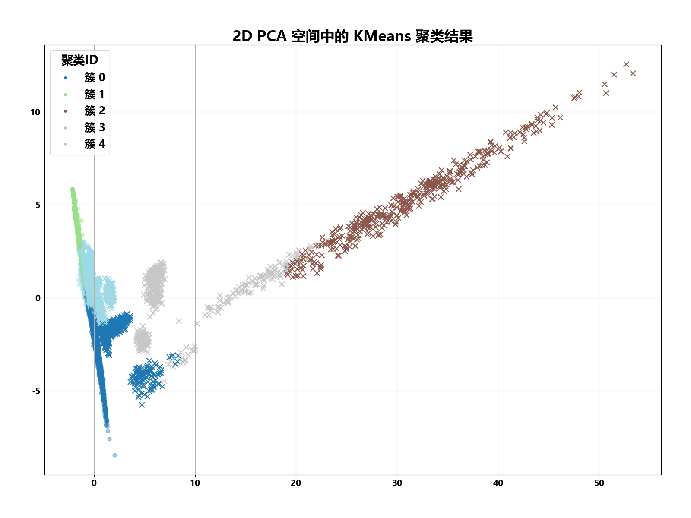
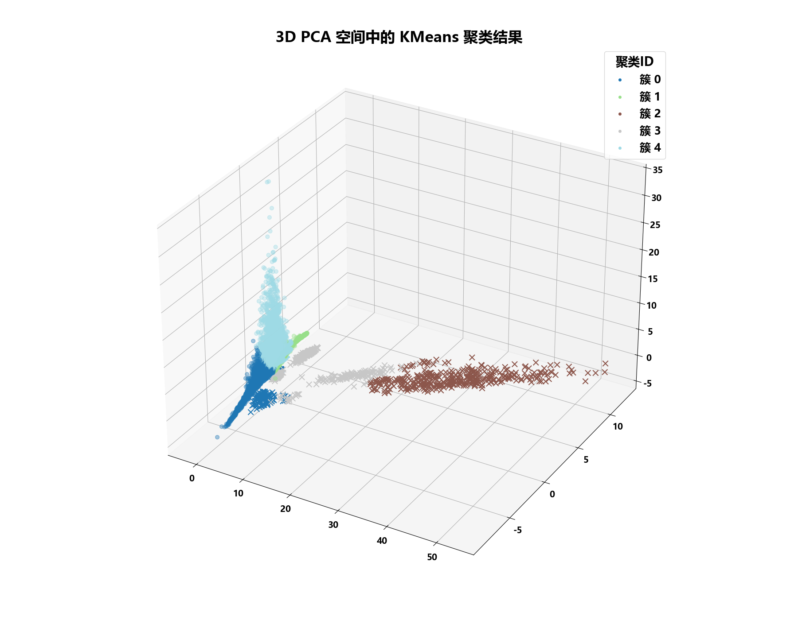
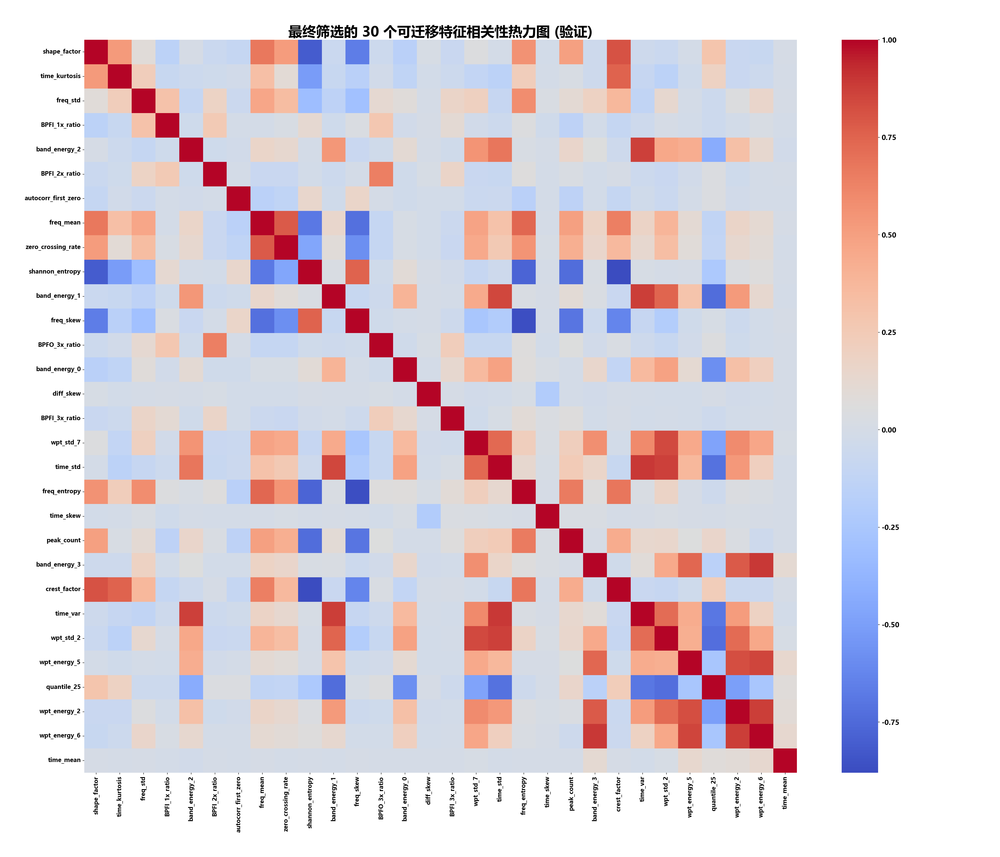
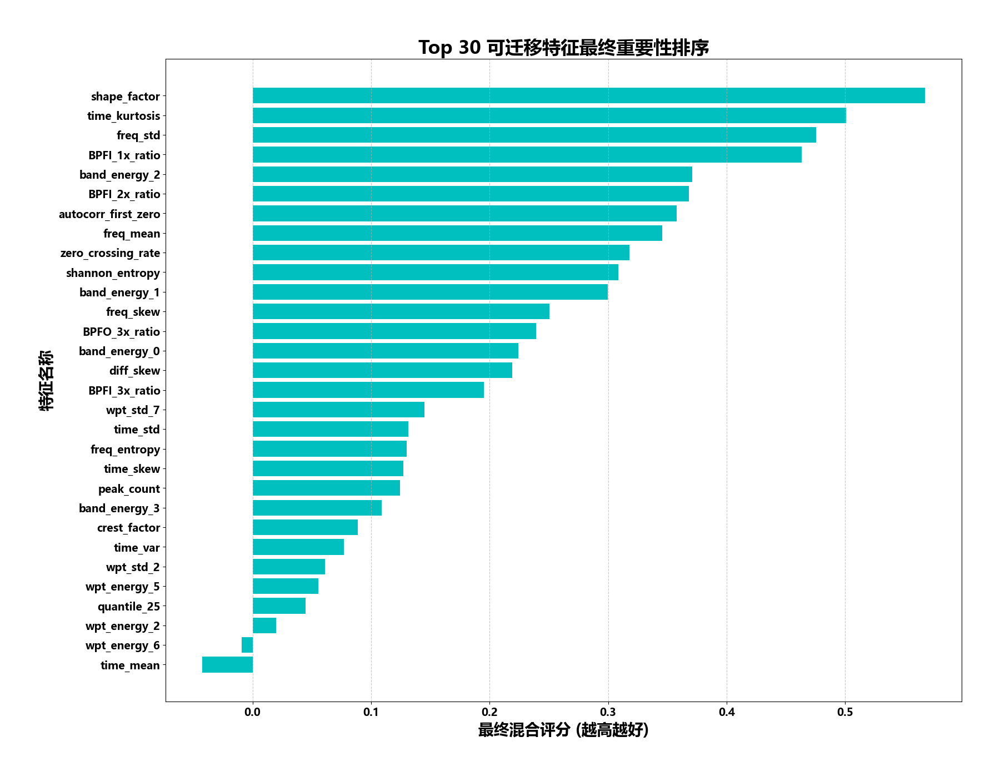
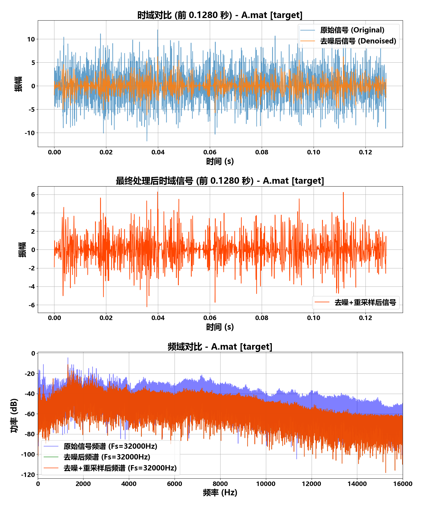

# 2025 国赛（华为杯）— Problem E 跨域光纤数据校准

"华为杯"第二十二届中国研究生数学建模竞赛 E 题完整作品。

## 赛题背景

16 个光纤传感器（A-P）采集高频振动信号（采样率不统一），振弦式传感器作为基准参考。需要建立从光纤数据到振弦基准的跨域映射模型，实现信号去噪、标准化重采样、特征提取、聚类分组和域自适应校准。

## 代码架构

### 第一问（阶段 1）：信号预处理 (`q1_stage1_preprocessing.py`)

```python
# 核心参数
TARGET_FS = 32000              # 目标采样率 32kHz
SEGMENT_LENGTH = 4096          # 段长度
OVERLAP_RATIO = 0.5            # 重叠率 50%
DENOISE_THRESHOLD_SCALER = 0.5 # 小波去噪阈值系数

# 处理管线
for each sensor (A-P):
    1. 读取 .mat 原始数据 → 提取振动信号
    2. PyWavelets 小波去噪 (DENOISE_THRESHOLD_SCALER=0.5)
    3. scipy.signal.resample → 重采样至 32kHz
    4. FFT 频域分析 + 时域对比
    5. plot_comparison(原信号, 去噪后, 最终) → 3×1 对比图

# 输出: preprocessed_data.pkl
```

### 第一问（阶段 2）：特征提取与聚类 (`q1_stage2_analysis.py`)

```python
# 从预处理后的 32kHz 信号中提取 76 维特征
# 频域: FFT 频谱质心、带宽、峰值频率、功率谱密度
# 时域: 均值、方差、偏度、峭度、自相关
# 时频: 小波包能量分布

# 聚类分析
from sklearn.cluster import KMeans, AgglomerativeClustering
# 将 16 个传感器分为 4 组
# 输出: clustering_result_2d.png, clustering_result_3d.png
```

### 第一问（阶段 3）：参数优化 (`q1_stage3_optimization.py`)

优化窗口大小、重叠率、去噪阈值等超参数，最大化信噪比。

### 第二问：特征工程与分类 (`q2_feature_engineering.py`)

```python
# 故障分类: 正常(N), 滚动体故障(B), 内圈故障(IR), 外圈故障(OR)
CLASS_MAPPING = {'N': 0, 'B': 1, 'IR': 2, 'OR': 3}

# 自定义 MLP + FeatureAttention
class MLP(nn.Module):
    # nn.Linear(input, 128) → ReLU → Dropout(0.5)
    # → nn.Linear(128, 64) → ReLU → Dropout(0.5)
    # → nn.Linear(64, num_classes=4)

class FeatureAttention(nn.Module):
    # nn.Linear(input_dim, 64) → ReLU → nn.Linear(64, input_dim) → Sigmoid
    # 输出: 每个特征的注意力权重

# Stacking 集成: LogisticRegression + RandomForest + SVC + XGBoost + LightGBM
# 元模型: LogisticRegression
ensemble = StackingClassifier(
    estimators=[('lr', LR), ('rf', RF), ('svc', SVC), ('xgb', XGB), ('lgb', LGB)],
    final_estimator=LogisticRegression()
)
```

### 第三&四问：域自适应校准 (`q3_q4_domain_adaptation.py`)

基于训练好的传感器分组，对每组分别建立从光纤域到振弦域的映射模型，评估校准精度。

## 关键图表

| 聚类结果 (2D) | 聚类结果 (3D) |
|:---:|:---:|
|  |  |

| 特征相关性热力图 | 特征重要性排序 |
|:---:|:---:|
|  |  |

| 传感器 A 去噪前后对比 |
|:---:|
|  |

## 数据规模

- 16 个光纤传感器（A-P），原始采样率不统一（~10kHz-50kHz）
- 统一重采样至 32kHz
- 段大小 4096 点，50% 重叠 → 约 8 段/传感器
- 76 维特征 → 特征选择 → 最终保留 15-20 维

## 技术栈

- **信号处理**: scipy.fft, PyWavelets (小波去噪), scipy.signal.resample
- **特征工程**: 频域统计量 + 时域统计量 + 时频分析
- **聚类**: KMeans, AgglomerativeClustering, 2D/3D 可视化
- **分类**: MLP (PyTorch), FeatureAttention, StackingClassifier (LR+RF+SVC+XGB+LGB)
- **可视化**: matplotlib (25pt 出版字体, 统一配色方案)

## 运行方式

```bash
pip install numpy scipy matplotlib pywavelets scikit-learn torch xgboost lightgbm

# 按顺序运行
python q1_stage1_preprocessing.py   # → preprocessed_data.pkl + 16组对比图
python q1_stage2_analysis.py        # → 聚类结果图
python q1_stage3_optimization.py    # → 最优参数
python q2_feature_engineering.py    # → 特征选择 + 分类器训练
python q3_q4_domain_adaptation.py   # → 域自适应校准
```

## 论文

- 完整论文和题目分析保留在原始工程目录 `2025国赛数学建模/` 中
