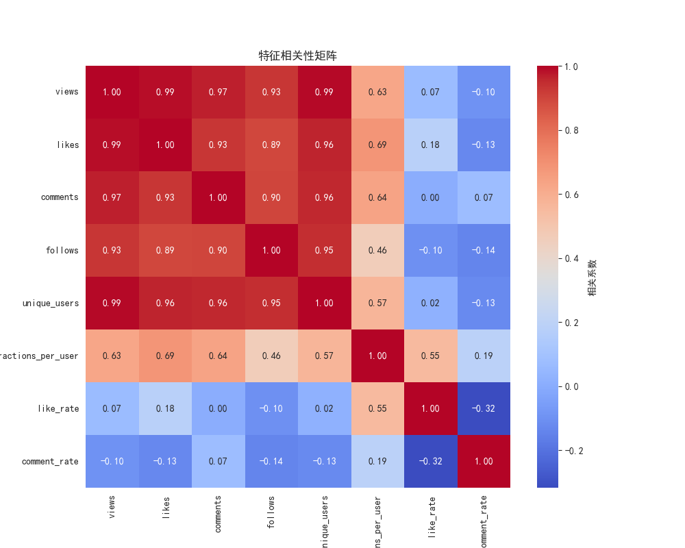
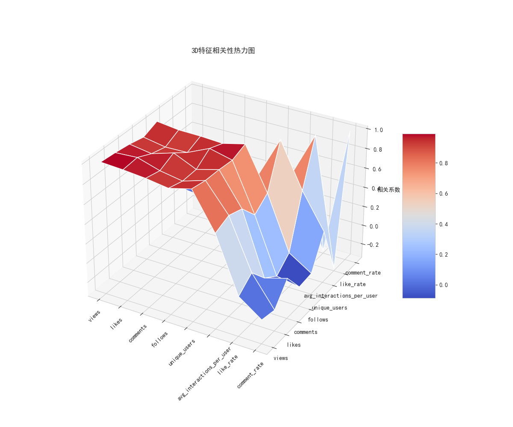
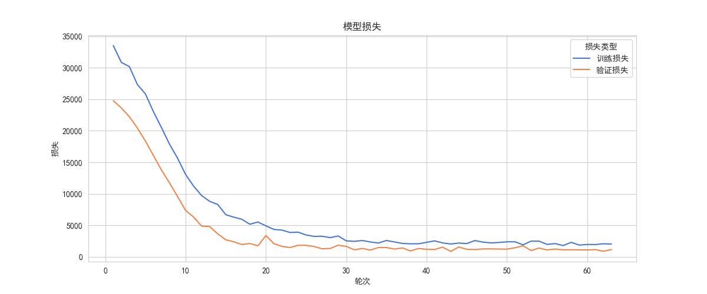
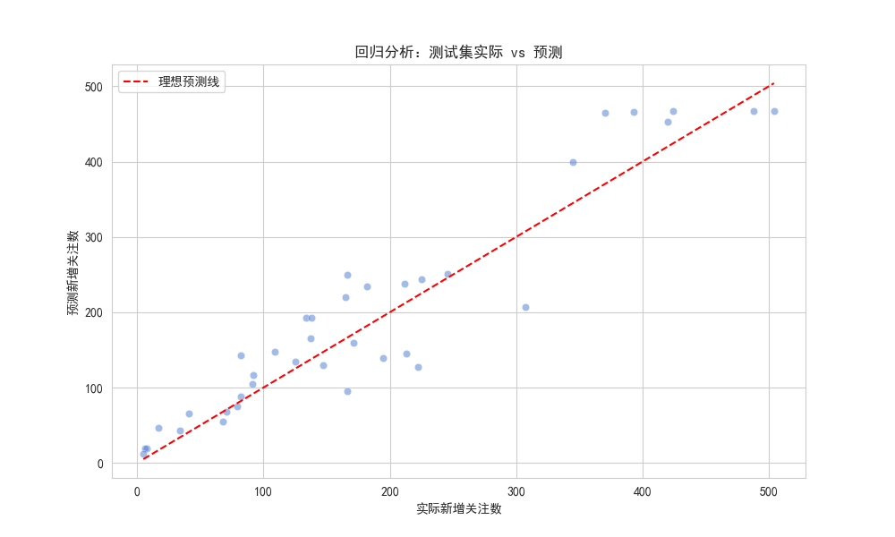
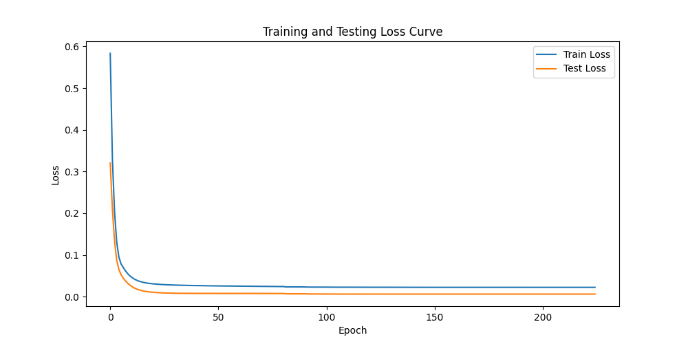
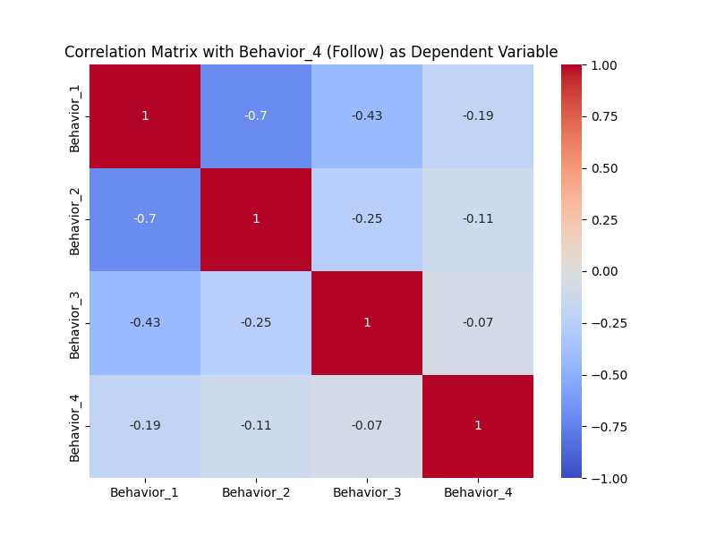

# 2025 校赛 — Problem C 社交媒体博主增长预测

51MCM 校级数学建模选拔赛 C 题完整作品。

## 赛题背景

基于社交媒体博主的历史粉丝增长、发帖行为、用户互动等数据，建立多模型融合预测系统，预测博主粉丝增长趋势、用户互动概率和活跃度变化。

## 代码架构

### 第一问：三模型融合粉丝预测

#### 数据处理 (`q1_data_processing.py`)

```python
# 数据清洗管线
1. 读取博主历史数据 (粉丝数、发帖频率、互动率、活跃天数)
2. 缺失值填补 (中位数/众数)
3. StandardScaler 标准化
4. 滑动窗口统计量 (7日/30日均值)
5. 趋势特征 (一阶差分、加速度)
6. 输出: 附件1_修改版.csv, 所有博主特征矩阵
```

#### 三模型融合 (`q1_three_model_fusion.py`)

```python
# 自定义 Transformer 编码器
class TransformerEncoder(nn.Module):
    # nn.TransformerEncoderLayer(d_model, nhead, dim_feedforward, dropout, batch_first=True)
    # nn.TransformerEncoder(encoder_layer, num_layers=2)

# MLP + LSTM + Transformer 级联架构
class MLPLSTMTransformerModel(nn.Module):
    def __init__(self, input_dim,
                 mlp_hidden_dims=[256, 128],    # MLP: 256 → 128
                 lstm_hidden_dim=128,             # LSTM hidden
                 d_model=128, nhead=8,            # Transformer
                 dim_feedforward=256, dropout=0.2):

    # 架构管线:
    # 输入特征
    #   → MLP (Linear+ReLU+Dropout 0.3): 256 → 128
    #   → LSTM (hidden=128, batch_first=True, dropout=0.2)
    #   → Transformer (d_model=128, nhead=8, 2层)
    #   → FC 输出层 → 粉丝增长预测值

# 训练配置
np.random.seed(42)
torch.manual_seed(42)
sns.set_style("whitegrid")
plt.rcParams['font.sans-serif'] = ['SimHei']
```

#### 流程可视化 (`q1_flowchart.py`)

生成数据处理 → 模型训练 → 预测输出的流程图和时序热力图。

### 第二问：新粉丝预测 (`q2_prediction.py`)

```python
# 线性回归 + 特征重要性分析
# 特征: 历史粉丝数、发帖频率、互动率、活跃天数
# 目标: 预测新粉丝数
# 输出: linear_feature_importance.png, pred_prob_hist.png, topk_user_distribution.png
```

### 第三问：互动概率预测 (`q3_neural_network.py`)

```python
# 神经网络多分类：预测用户在线互动概率
# 数据: Attachment 1.csv (用户-博主互动记录)
# 模型: 全连接网络
# 输出: user_timeline (U9/U16/U22405/U48420), loss_curve, correlation_matrix
# 最好模型保存: best_model.pth
```

### 第四问：用户行为建模 (`q4_behavior_model.py` + `q4_pre_analysis.py`)

```python
# 目标用户: U10, U1951, U1833, U26447
# 时间段: 2024-07-11 ~ 2024-07-20

# 数据预分析 (q4_pre_analysis.py):
#   用户活跃频率统计、时间分布、行为模式识别

# 特征工程 (q4_behavior_model.py):
#   - 小时段独热编码 (24维)
#   - 在线频率: 用户行为数/活跃天数
#   - 上次活动间隔时间
#   - 博主互动特征

# 模型: PyTorch 全连接网络
# 目标: 预测用户行为类型和时间
# 评估: MSE, R², MAE, AUC, F1

# 输出:
#   - 4个目标用户的 timeline 图 (时间线行为分布)
#   - loss_curve: sun_shi_qu_xian.png
#   - correlation_matrix: xiang_guan_ju_zhen.png
#   - 预测结果: yu_ce_jie_guo.csv
#   - 评估指标: ping_gu_zhi_biao.csv
#   - 模型: zui_jia_mo_xing.pth
```

## 关键图表

| 相关矩阵 (2D) | 相关矩阵 (3D) |
|:---:|:---:|
|  |  |

| 训练过程 | 回归分析 |
|:---:|:---:|
|  |  |

| 第三问损失曲线 | 第三问相关矩阵 |
|:---:|:---:|
|  |  |

## 运行方式

```bash
pip install pandas numpy scikit-learn torch matplotlib seaborn mpl_toolkits

# 第一问
python q1_data_processing.py      # 数据清洗与特征工程
python q1_three_model_fusion.py   # 三模型融合训练预测
python q1_flowchart.py            # 流程可视化

# 后续问题
python q2_prediction.py           # 新粉丝预测
python q3_neural_network.py       # 互动概率预测
python q4_pre_analysis.py         # 数据预分析
python q4_behavior_model.py       # 用户行为建模
```

## 论文

- `2025校赛数学建模/2025-51MCM-Problem C（更新版）/牛逼888.pdf` — 完整竞赛论文
