# 问题 1：多源传感器数据校正

## 问题定义

新型光纤位移计（传感器 A）存在**非线性零漂**和**时变累积误差**，以传统振弦式位移计（传感器 B）为基准进行校正。输入为 10,000 个采样点的 A/B 位移数据，输出为 5 个孤立值（表 1.1）的校正结果。

## 代码架构

### DataProcessor (`data_processing.py`)

```python
class DataProcessor:
    def load_data(self):
        """读取 Excel → 自动识别列名(Time/A/B) → 计算相对时间 T_minutes"""
        # 采样频率: 10分钟/次，10,000 采样点
        # A范围: [0.000, 395.053] mm, B范围: [0.000, 339.544] mm

    def plot_eda(self, save_dir="eda_plots"):
        """4张探索性分析图 (300 DPI)"""
        # 01_raw_comparison    — A vs B 原始时序对比
        # 02_error_analysis    — 误差时序 + 累积误差增长趋势
        # 03_scatter_distribution — A vs B 颜色渐变散点(2k采样) + 误差分布直方图(100 bins)
        # 04_statistics_summary — 统计摘要表(均值/标准差/相关系数)

    def apply_ceemdan(self, a_series, max_imf=5):
        """CEEMDAN 自适应模态分解 → 剔除 IMF1 高频毛刺 → 重构 A_smooth"""
        # PyEMD.CEEMDAN() → imfs
        # A_smooth = Σ IMF[2:]  (剔除 IMF1)
        return imfs, a_smooth

    def extract_features(self, df, a_smooth):
        """构建 11 维特征"""
        # A_smooth:  CEEMDAN去噪后平滑值
        # A_sq:     二次项 f(A)²
        # A_cube:   三次项 f(A)³
        # A_vel:    一阶差分（速度特征）
        # A_bin:    pd.qcut(q=10) 分位数分箱（离散化）
        # A_diff2:  二阶差分
        # A_ratio:  A / 50步滚动均值（短期波动率）
        # A_rolling_mean_50: 50步滚动均值
        # A_rolling_std_50:  50步滚动标准差
        # A_deviation: A - rolling_mean（偏离趋势量）
        # T_norm:    归一化时间 [0, 1]
```

### ModelBase 与四模型实现 (`model_algorithm.py`)

```python
class ModelBase:
    """统一接口: train(df) → predict(df_pred) → cross_validate(df, n_splits=5)"""
    def evaluate(self, y_true, y_pred):
        return (np.sqrt(MSE), MAE, R²)  # RMSE, MAE, R2

class RidgeRegressor(ModelBase):     # ← 最优模型
    # Pipeline: PolynomialFeatures(2) + Ridge(α=1.0)
    # features: ['A']

class PolynomialRegressor(ModelBase): # 过拟合
    # Pipeline: PolynomialFeatures(3) + Ridge(α=0.01)
    # features: ['A']

class SVRRegressor(ModelBase):       # 严重过拟合
    # Pipeline: StandardScaler + SVR(kernel='rbf', C=10, ε=0.5~1.0)

class BaselineXGB(ModelBase):        # 基线参考
    # XGBRegressor(n_estimators=50, max_depth=2, lr=0.01,
    #              subsample=0.5, colsample_bytree=0.5,
    #              reg_alpha=10, reg_lambda=50, min_child_weight=10)
    # features: ['A_smooth', 'A_sq', 'A_cube', 'A_bin', 'A_vel']
```

## 5 折时序交叉验证结果

采用 `TimeSeriesSplit(n_splits=5)` 保持时间顺序，评估各模型泛化能力：

| 模型 | CV RMSE | CV MAE | CV R² | 结论 |
|------|---------|--------|-------|------|
| **Ridge (2阶+L2)** | **3.3081** | **2.3349** | **0.9542** | ✅ 泛化优秀 |
| Poly3 (3阶+低正则) | 11.1965 | 9.0492 | -0.0854 | ❌ 严重过拟合 |
| SVR (RBF) | 49.5573 | 40.5224 | -8.4105 | ❌ 严重过拟合 |

**关键发现**: 2 阶多项式 + L2 正则化（Ridge α=1.0）是最优选择。高阶多项式和 RBF 核在 10k 样本上过度记忆训练噪声，CV R² 降为负值。

## 表 1.1 填报结果

| 校正前 x (A值) | 校正后 y (Ridge最佳) |
|:---:|:---:|
| 7.132 | **5.930** |
| 18.526 | **15.961** |
| 84.337 | **73.906** |
| 123.554 | **108.439** |
| 167.667 | **147.287** |

## 结果图示

### EDA 探索性分析

| 原始 A vs B 时序对比 | 误差分析与累积漂移 |
|:---:|:---:|
| 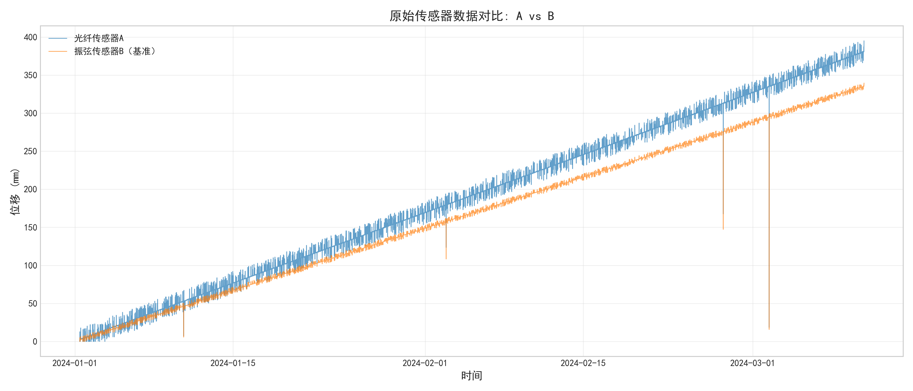 | 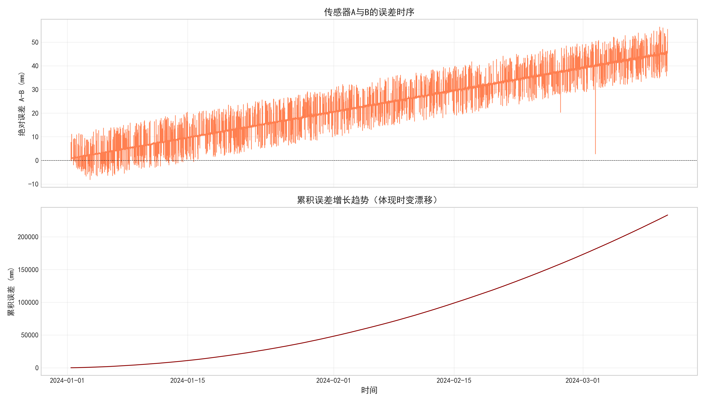 |

| A vs B 散点图 (颜色=时间) + 误差分布 | 统计摘要表 |
|:---:|:---:|
| 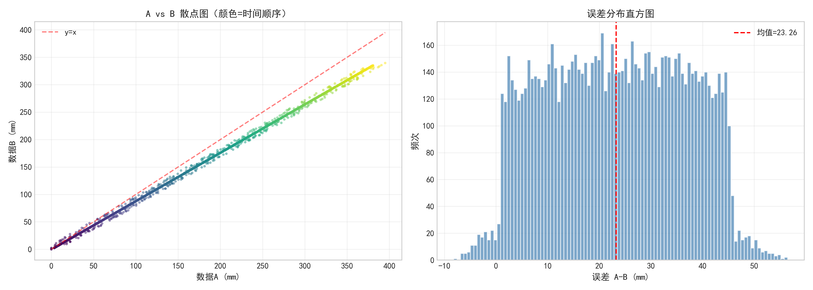 | 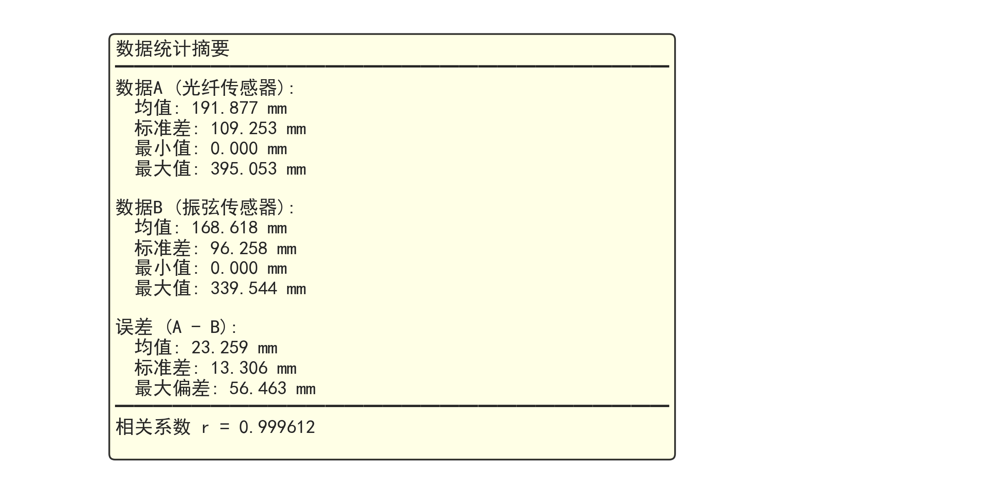 |

### CEEMDAN 信号分解

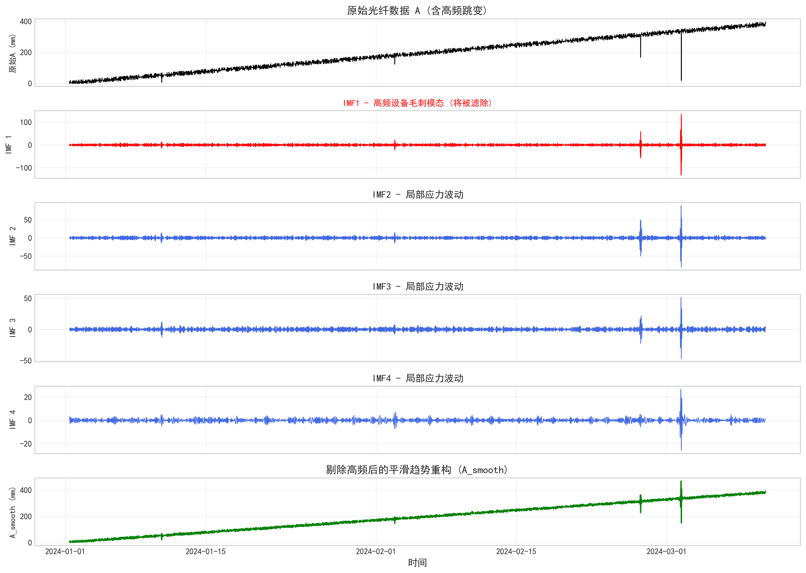

CEEMDAN 将含噪声的 A 信号分解为多个 IMF 分量。IMF1 捕获高频设备毛刺（被剔除），IMF2~保留为有效低频趋势并重构为 A_smooth。

### 非线性漂移校正主图

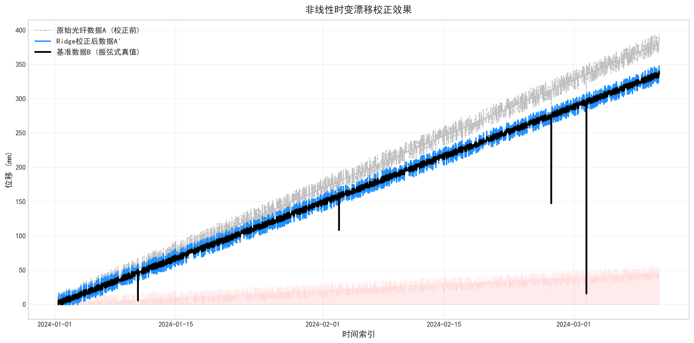

红色误差遮罩层（最底层 zorder）显示校正前后的差异幅度。蓝线（校正后 A'）与黑线（基准 B）高度重合，验证了校正效果。

### 残差分析

| 残差热力图 (校正量 × 残差) | 校正量分布直方图 |
|:---:|:---:|
| 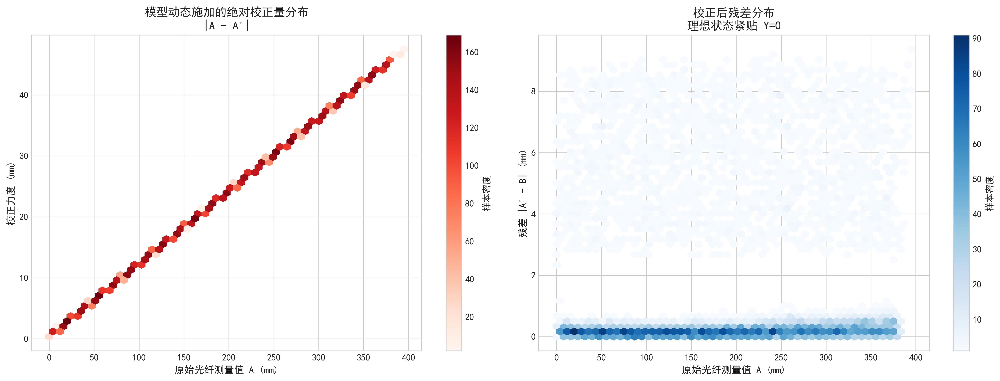 | 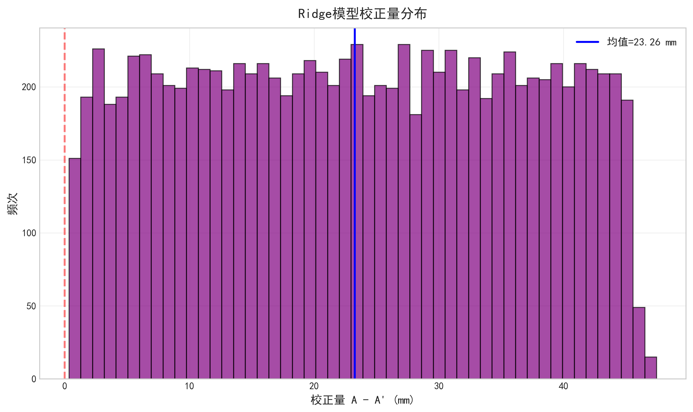 |

### 多模型校正效果对比

| 原始数据 A vs B | 多模型对比 |
|:---:|:---:|
| 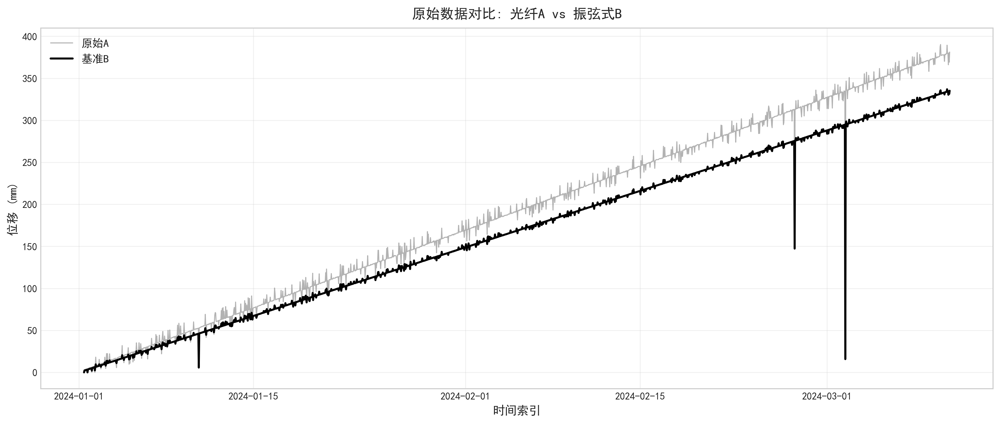 |  |

### 误差统计验证

| 误差分布直方图 | 误差箱线图 | 累积误差曲线 |
|:---:|:---:|:---:|
| 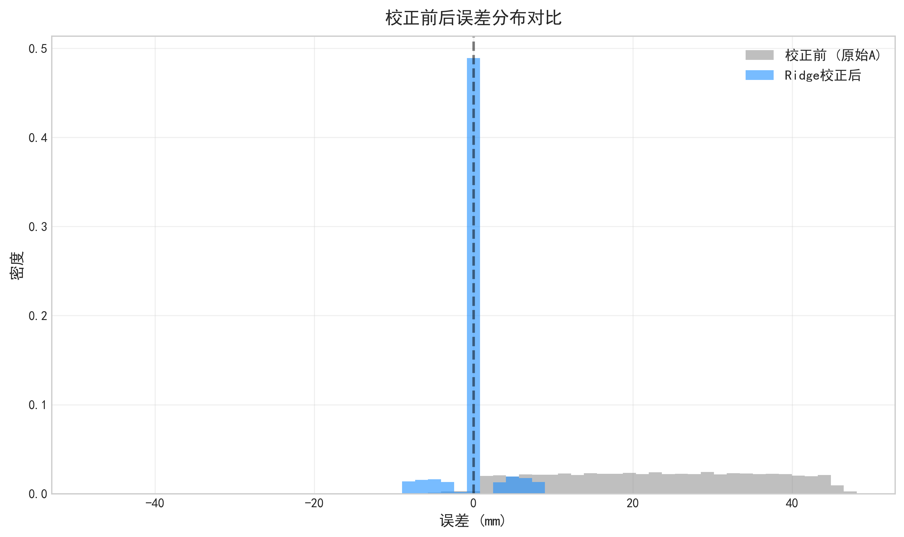 | 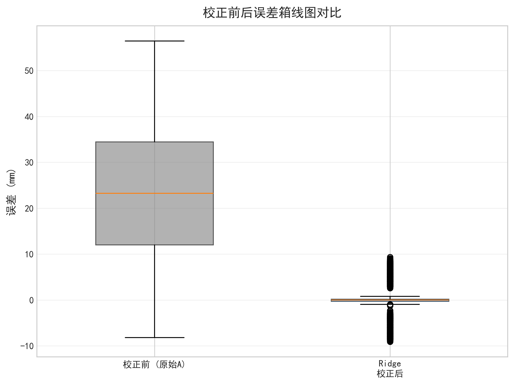 | 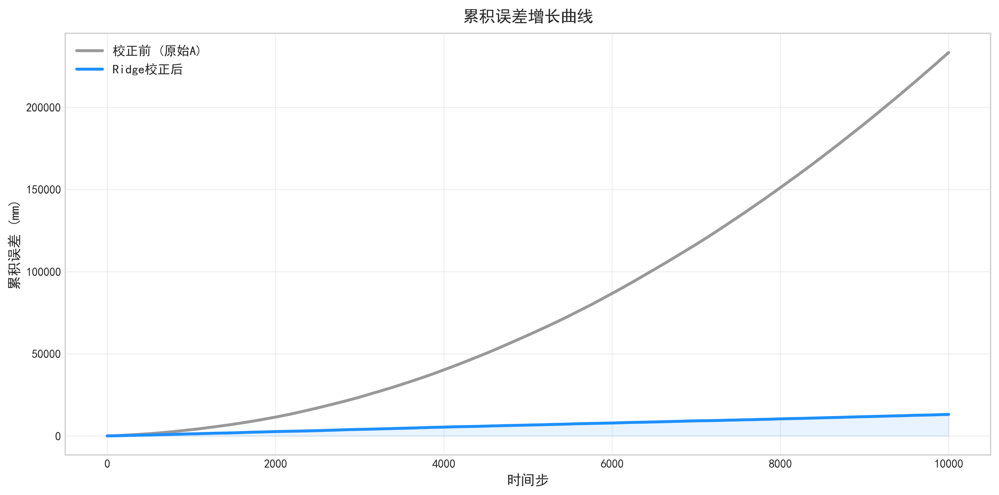 |

| 误差 vs A 值散点 | 误差正态 QQ 图 | 误差时序 |
|:---:|:---:|:---:|
| 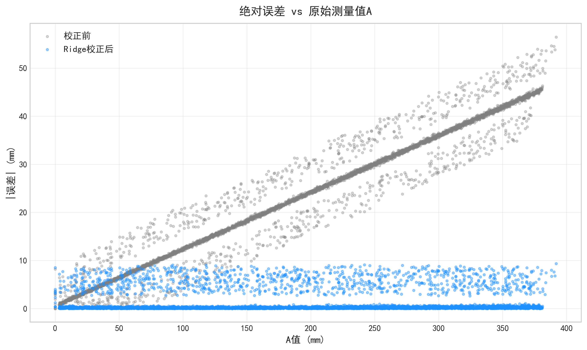 | 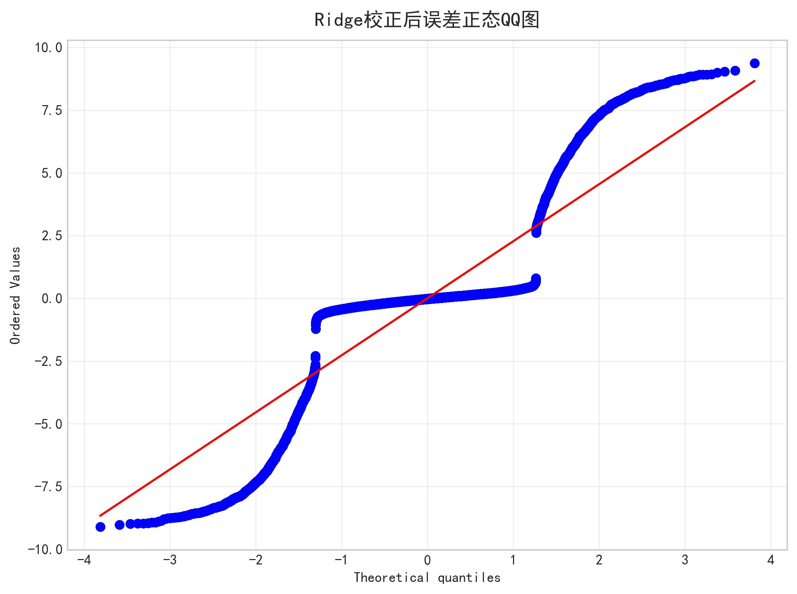 | 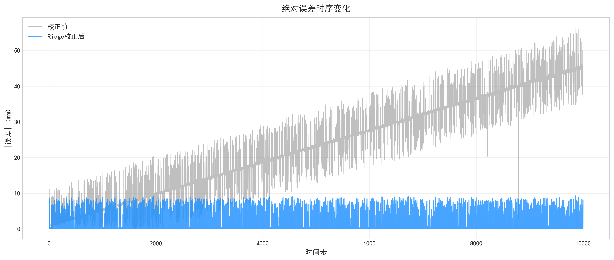 |

### 校正散点验证

| 校正前 A vs B | Ridge 校正后 A' vs B | 最佳模型校正后 |
|:---:|:---:|:---:|
| 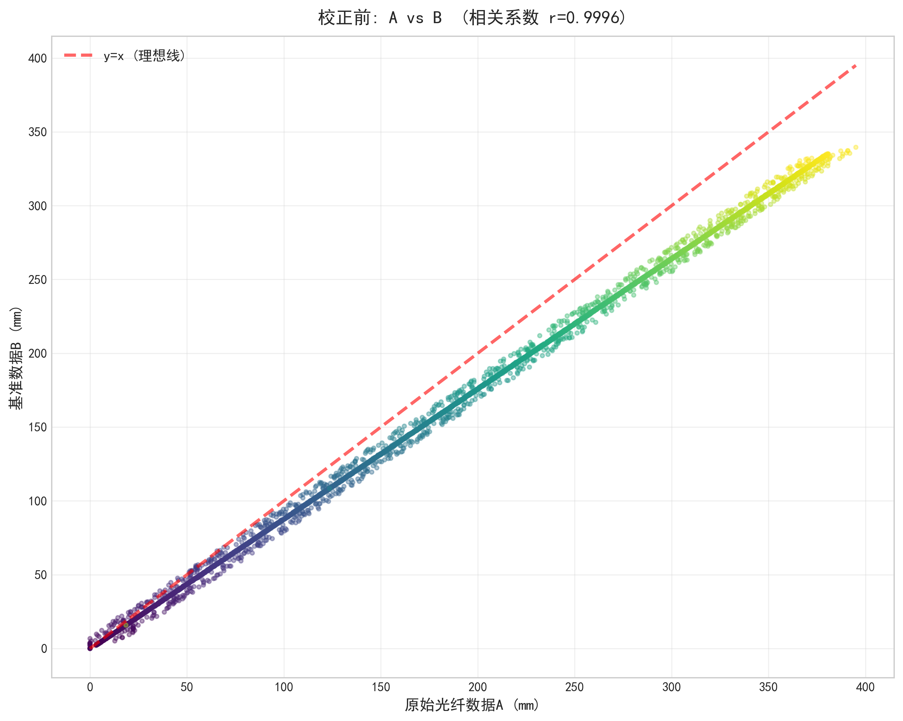 | 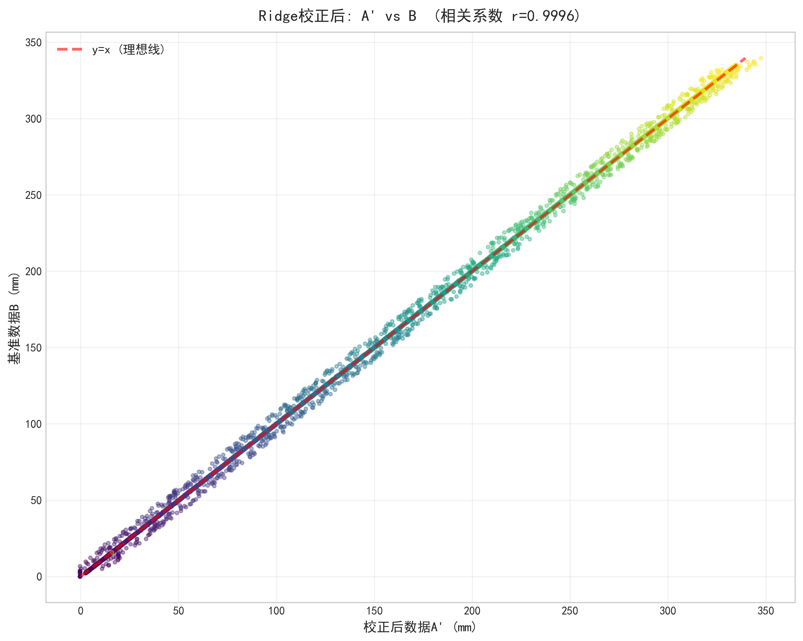 |  |

## 运行方式

```bash
pip install numpy pandas scikit-learn PyEMD matplotlib seaborn openpyxl scipy xgboost
cd q1_sensor_calibration
python main.py
```

运行后自动在 `figures/eda/` 和 `figures/output/` 生成全部 21 张图表。
