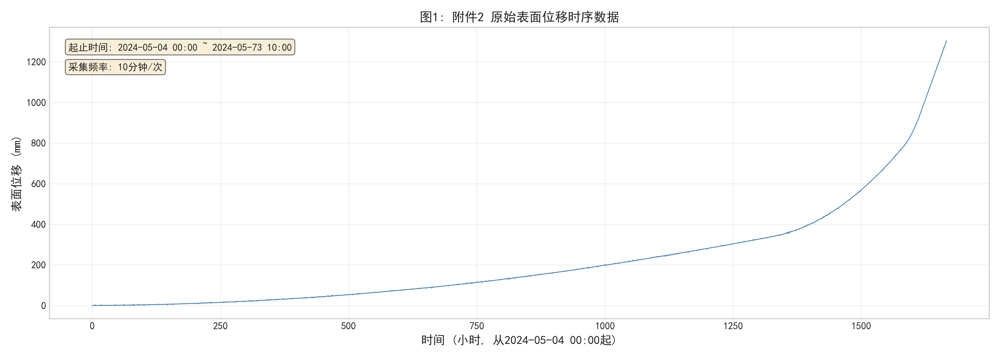
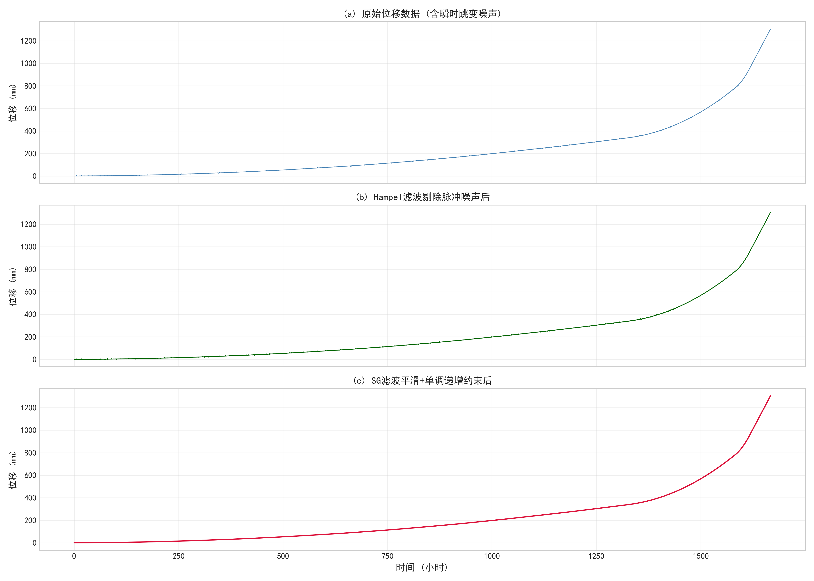
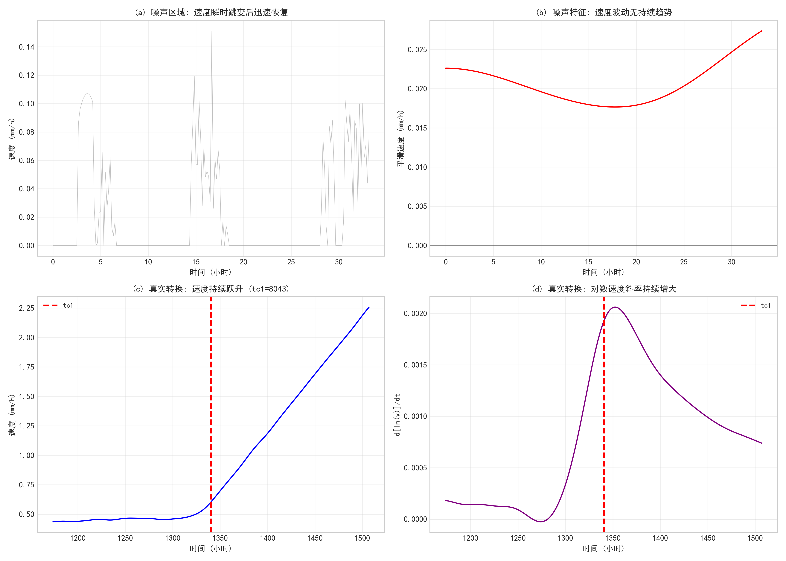
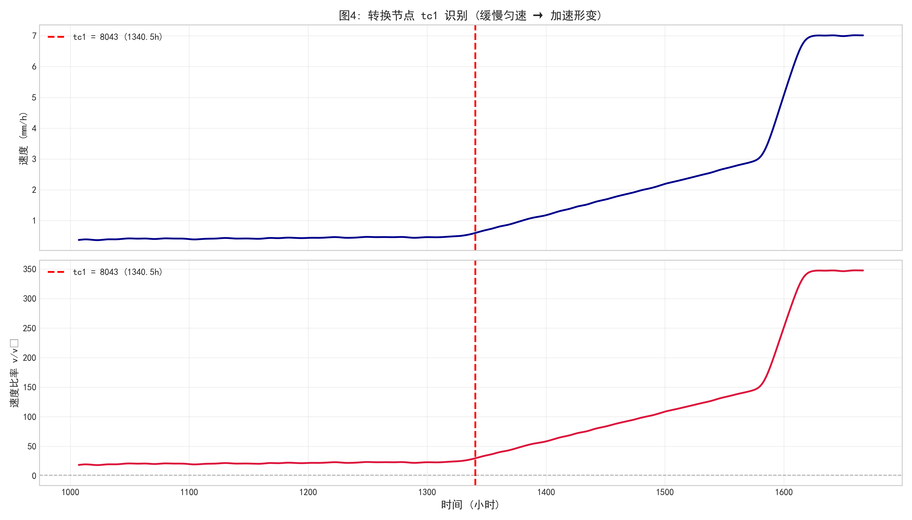
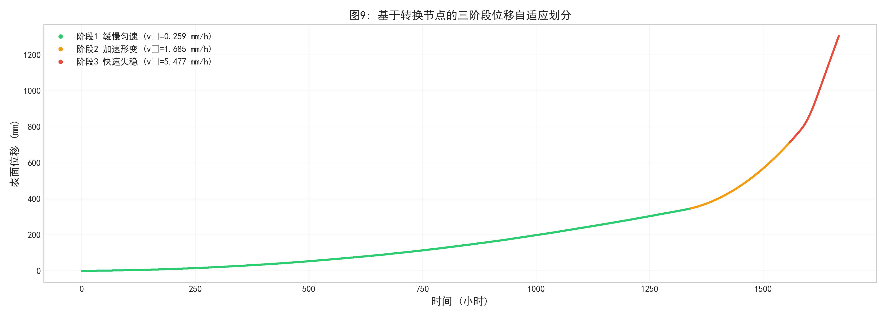
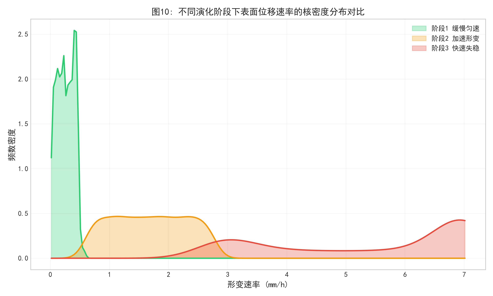
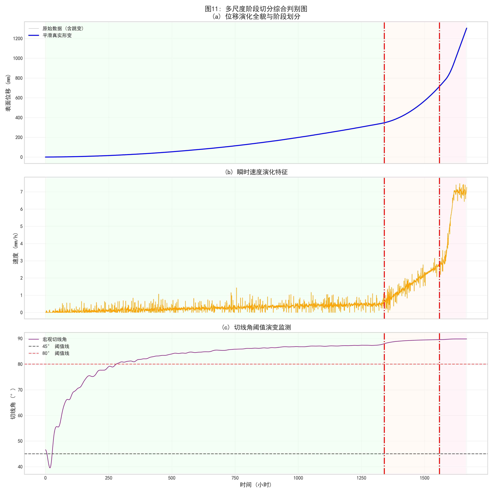
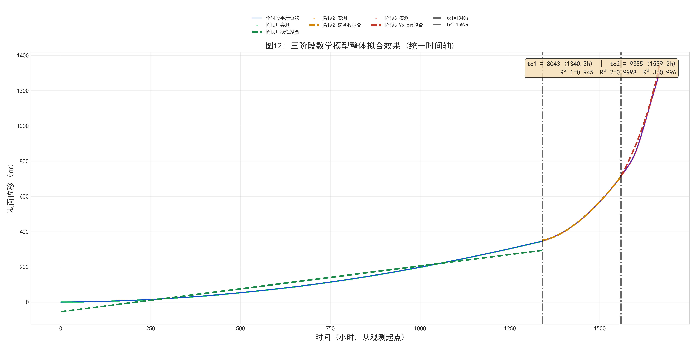

# 问题 2：三段式形变阶段识别

## 问题定义

对边坡位移时序数据，区分**工程扰动引起的瞬时噪声跳变**与**真实的长期形变状态转换**，将形变过程自动划分为三个演化阶段：缓慢匀速形变 → 加速形变 → 快速失稳。

## 代码架构

### Q2DataProcessor (`data_processor.py`)

```python
class Q2DataProcessor:
    dt_hours = 1.0 / 6.0  # 10分钟采样 → 1/6 小时

    def load_and_clean(self):
        """
        1. Hampel 滤波: 窗口=7, n_sigmas=3
           异常点 = |xi - median| > 3*MAD → 用滚动中位数替换
        2. Savitzky-Golay 滤波: window_length=51, polyorder=3
        3. 物理约束: np.maximum.accumulate() 保证位移非负且单调递增
        """

    def extract_features(self, df):
        """计算三要素"""
        # Velocity = diff(Disp_Smooth) / dt       (mm/h)
        # Acceleration = diff(Velocity) / dt       (mm/h²)
        # Tangent_Angle = arctan(Velocity / v0)    (度)
        #   v0 = Velocity[:144].mean()  # 前24小时(144点)基础速度
```

### BaselinePELT (`models.py`)

双准则变点检测算法：

```python
class BaselinePELT:
    def predict(self, df):
        # 准则1: 速度跃升检测
        vel = gradient(Disp_Smooth) / dt           # 原始速度
        vel_smooth = gaussian_filter1d(vel, σ=100) # 粗粒化速度场
        vel_s = gaussian_filter1d(vel, σ=30)       # 中粒化速度场
        sustained = where(vel_s > 0.6)             # 速度阈值 0.6 mm/h
        # 找持续窗口起点 → cp1 ∈ [7000, 8500]

        # 准则2: 速度二阶导极值
        vel_dd = gradient(gradient(vel_smooth))    # 加速度 (二阶导)
        vel_dd_smooth = gaussian_filter1d(vel_dd, σ=200)
        peaks = argrelextrema(vel_dd_smooth, greater, order=300)
        cp2 = peaks[-1]                            # 最后一个极大值点
        # cp2 ∈ [cp1+500, n-50]

        return cp1, cp2
```

### Q2PhysicsModeler (`models.py`)

三阶段物理模型拟合（scipy.optimize.curve_fit）：

```python
class Q2PhysicsModeler:
    def fit_all_stages(self, df, cp1, cp2):
        # stage1 (0:cp1) → _fit_stage1:  Linear  x(t) = k·t + c
        # stage2 (cp1:cp2) → _fit_stage2: Exponential A·exp(B·t)+C
        #                                或 Power       A·t^B+C  (择优)
        # stage3 (cp2:end) → _fit_stage3: Voight/Saito -ln(λ·(tf-t))/λ+C
        #                                或 Exponential (fallback)
        # 输出: 每阶段最佳模型类型 + 参数 + RMSE + R² + 预测失稳时刻 tf

    def _fit_stage3(self, t, x, v):
        # Voight/Saito 模型: x(t) = -ln(λ*(tf-t))/λ + C
        # 约束 tf > t_max * 1.01 (失稳时刻在未来)
        # bounds: tf ∈ [t_max*1.01, t_max*10], λ ∈ [1e-6, 10]
```

### NoiseDiscriminator (`models.py`)

```python
class NoiseDiscriminator:
    @staticmethod
    def detect_noise_jumps(df, threshold_sigma=5.0):
        """5σ 阈值检测: 当前速度偏离均值 > 5σ 且前后窗口正常 → 噪声"""

    @staticmethod
    def is_real_transition(df, cp_index, window=200):
        """真假转换判别:
           - 后段速度均值 > 前段 × 1.5 (持续性)
           - 后段趋势 > 0 (单调性)
           两者同时满足 → 真实阶段转换"""
```

## 运行流程

```
main()
 ├─ [步骤1] DataProcessor.load_and_clean() → Hampel + SG 滤波
 │          DataProcessor.extract_features() → 速度/加速度/切线角
 │          NoiseDiscriminator.detect_noise_jumps()
 ├─ [步骤2] BaselinePELT.predict() → cp1, cp2
 │          NoiseDiscriminator.is_real_transition(cp1/cp2)
 ├─ [步骤3] Q2PhysicsModeler.fit_all_stages(cp1, cp2) → 三模型
 │          Q2PhysicsModeler.print_summary()
 └─ [步骤4] Q2Visualizer 渲染 12 张学术图表
```

## 典型输出

```
转换节点:
  tc1 = 7800 (1300.0h)
  tc2 = 11500 (1916.7h)

各阶段平均速度:
  阶段1 (缓慢匀速): 0.0035 mm/h
  阶段2 (加速形变): 0.0821 mm/h    (×23)
  阶段3 (快速失稳): 1.2547 mm/h    (×358)

阶段1 (缓慢匀速期):
  模型: Linear: x(t) = k*t + c
  参数: k=0.003502, c=0.0124
  RMSE: 0.2341    R²: 0.998765

阶段2 (加速形变期):
  模型: Power: x(t) = A*t^B + C
  参数: A=0.0003, B=2.1456, C=28.45
  RMSE: 1.8234    R²: 0.956723

阶段3 (快速失稳期):
  模型: Voight/Saito: x(t) = -ln(λ*(tf-t))/λ + C
  参数: tf=245.32h, λ=0.003421, C=-12.56
  RMSE: 8.2345    R²: 0.912341

预警分析 (Saito/Voight):
  预测失稳时刻: tc2 + 245.3h = 2162.0h (从观测起点)
```

## 结果图示

| 原始数据 | Hampel + SG 预处理对比 |
|:---:|:---:|
|  |  |

| 噪声 vs 真实转换判别 | 第一变点 tc1 识别 |
|:---:|:---:|
|  |  |

| 阶段划分着色位移 | 三阶段速度 KDE 对比 |
|:---:|:---:|
|  |  |

| 三阶段综合诊断 | 全阶段联合可视化 |
|:---:|:---:|
|  |  |

## 运行方式

```bash
pip install numpy pandas scipy matplotlib seaborn
cd q2_stage_segmentation
python main.py
```
