# 问题 4：含爆破扰动的分阶段演化预测

## 问题定义

基于降雨量、孔隙水压力、微震事件数、爆破振动等 5 维特征，分阶段预测表面位移。训练集含全部 6 维（含位移），实验集不含位移需独立预测。

核心难点："爆破"作为稀疏、极值型偶发事件，对位移有滞后和非线性冲击。

## 完整管线 (`main.py`)

### Step 1: 高级特征工程

```python
FEATURES = ['降雨量_mm', '孔隙水压力_kPa', '微震事件数', '爆破振动烈度_V',
            '降雨量_2h_sum', '孔压_2h_mean', '孔压_2h_diff', '水力耦合因子']
TARGET = '表面位移增量_mm'

def load_and_engineer_features(train_path, test_path):
    # 1. 爆破特征重构 — 萨道夫斯基经验公式
    df['爆破振动烈度_V'] = where(
        df['爆破点距离_m'] > 0,
        (df['单段最大药量_kg'] ** (1/3)) / df['爆破点距离_m'],
        0
    )

    # 2. 时间滞后特征
    df['降雨量_2h_sum'] = df['降雨量'].rolling('2h').sum()
    df['孔压_2h_mean'] = df['孔压'].rolling('2h').mean()
    df['孔压_2h_diff']  = df['孔压'].diff().rolling('2h').mean()

    # 3. 水力耦合因子 (物理交叉特征)
    df['水力耦合因子'] = 降雨量_24h × 孔压差分
```

### Step 2: K-Means 阶段划分

```python
# 基于位移变化量和速率特征空间聚类
kmeans = KMeans(n_clusters=3, random_state=42)
df['Stage'] = kmeans.fit_predict(位移变化特征矩阵)

# 三阶段:
#   Stage 1 (缓慢匀速): Δdisp ≈ 10mm
#   Stage 2 (加速形变): Δdisp ≈ 50mm
#   Stage 3 (快速形变): Δdisp ≈ 594mm
```

### Step 3: 异构集成学习

```python
# 每阶段独立训练 VotingRegressor
ensemble = VotingRegressor([
    ('gbdt',   GradientBoostingRegressor(n_estimators=200, max_depth=5)),
    ('rf',     RandomForestRegressor(n_estimators=200, max_depth=10)),
    ('et',     ExtraTreesRegressor(n_estimators=200, max_depth=10))
])

stage_models = {}
for stage in [1, 2, 3]:
    X_stage = df[df['Stage'] == stage][FEATURES]
    y_stage = df[df['Stage'] == stage][TARGET]
    stage_models[stage] = ensemble.fit(X_stage, y_stage)
```

### Step 4: 实验集预测与阶段校准

```python
# 核心创新: 阶段校准机制
校准系数 = 训练集阶段位移变化 / 当前预测阶段总增量

# 确保实验集预测遵循与训练集相同的物理位移演化规律
pred_calibrated = pred_raw * 校准系数
```

## 预测结果

| 要求时间点 | 预测位移 (mm) | 所属阶段 |
|-----------|:---:|---------|
| 2025-05-09 12:00 | 4.032 | 阶段 1（缓慢形变） |
| 2025-05-27 08:00 | 30.268 | 阶段 2（加速形变） |
| 2025-06-01 12:00 | 57.088 | 阶段 2（加速形变） |
| 2025-06-03 22:00 | 391.166 | 阶段 3（快速形变） |
| 2025-06-04 01:40 | 415.285 | 阶段 3（快速形变） |

## 输出图表（18 张，300 DPI）

### EDA 时序分析

| 表面位移 | 降雨量 | 孔隙水压力 | 扰动强度 |
|:---:|:---:|:---:|:---:|
| 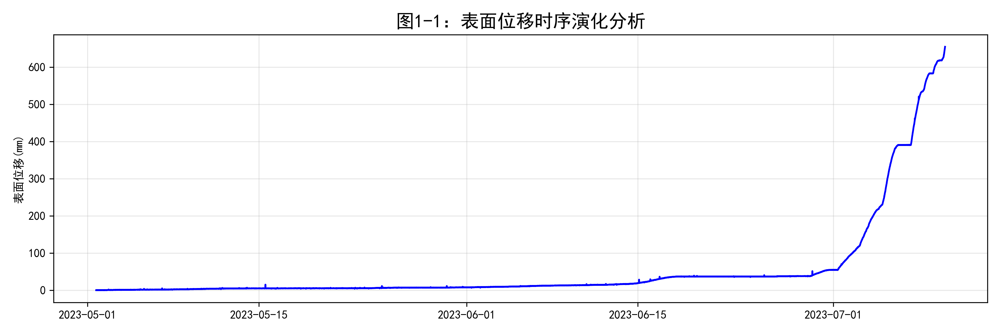 | 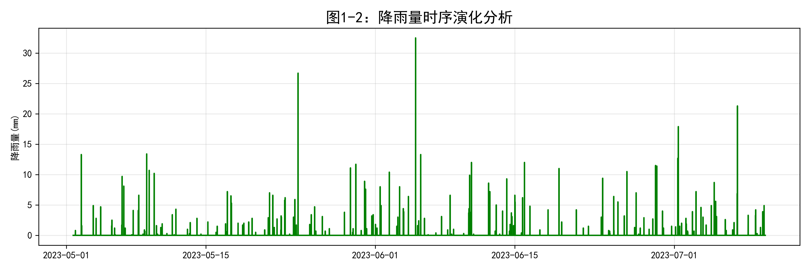 | 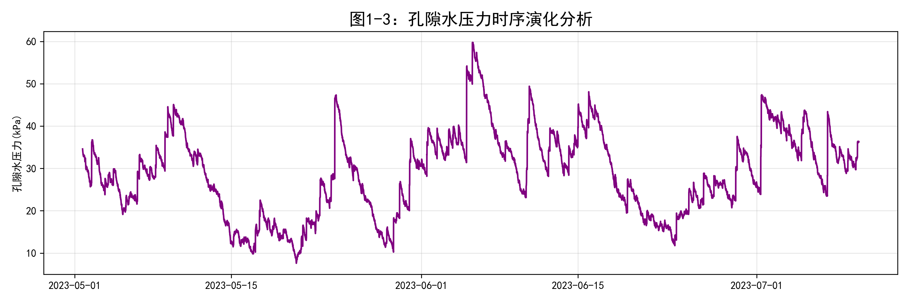 | 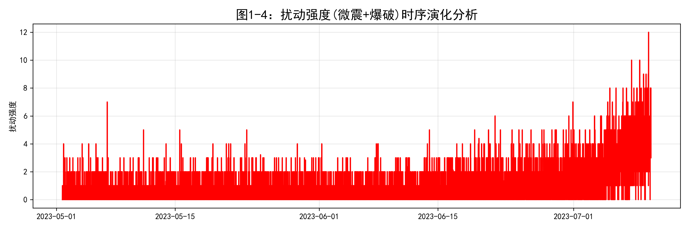 |

### 特征与阶段分析

| 相关热力图 | K-Means 阶段聚类 | 速度 KDE |
|:---:|:---:|:---:|
| 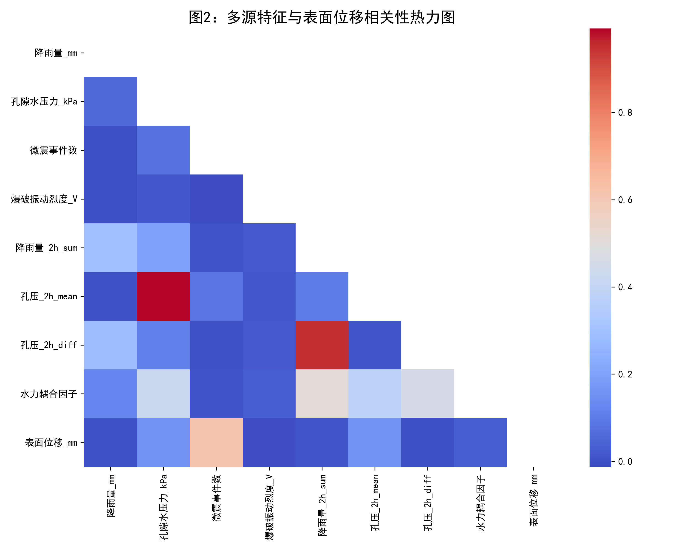 | 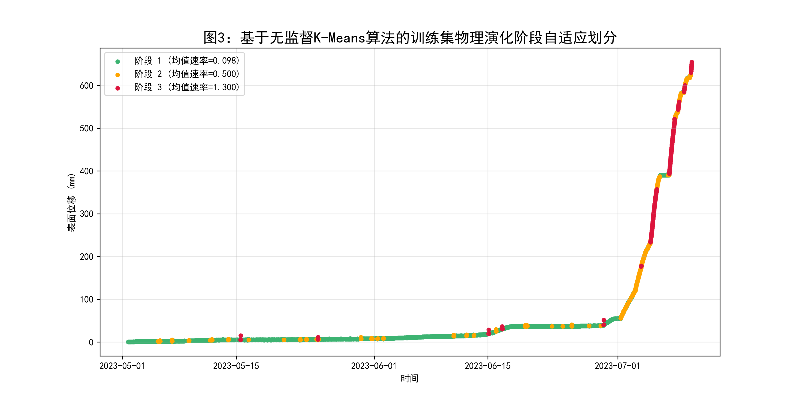 | 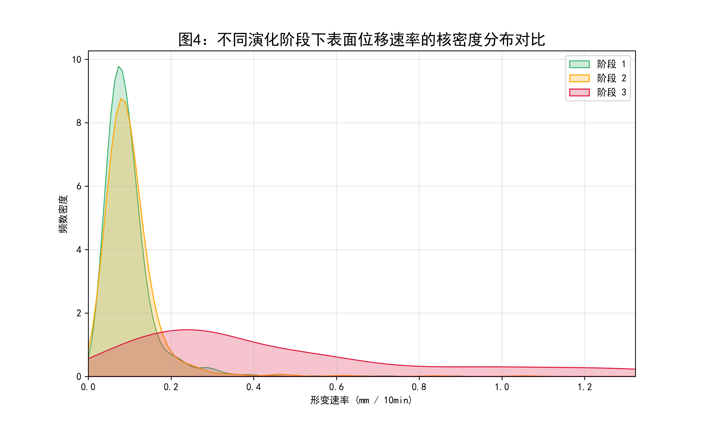 |

| 分阶段特征重要性 | 水力耦合散点 |
|:---:|:---:|
| 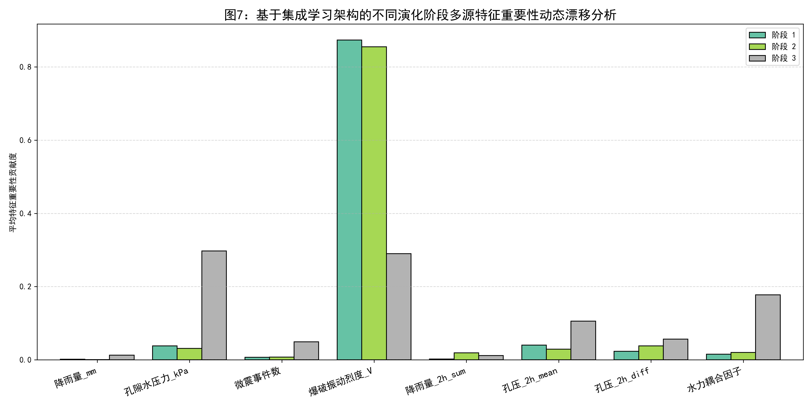 | 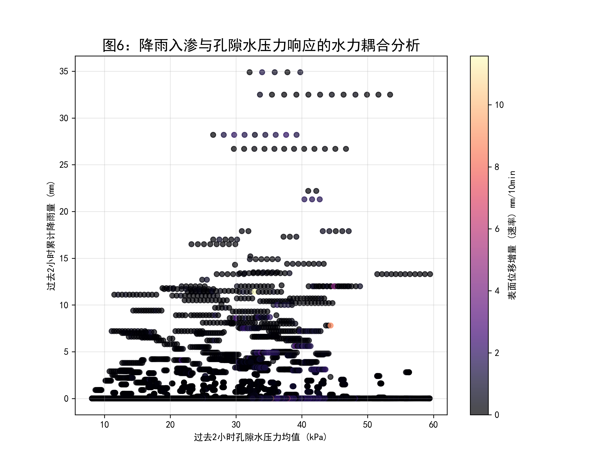 |

### 预测结果

| 形变速率脉冲 | 全周期预测曲线 | 95% 置信包络 |
|:---:|:---:|:---:|
| 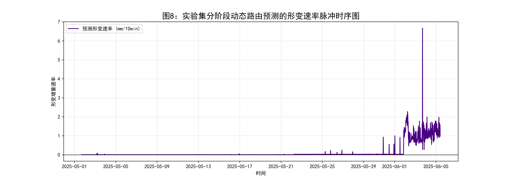 | 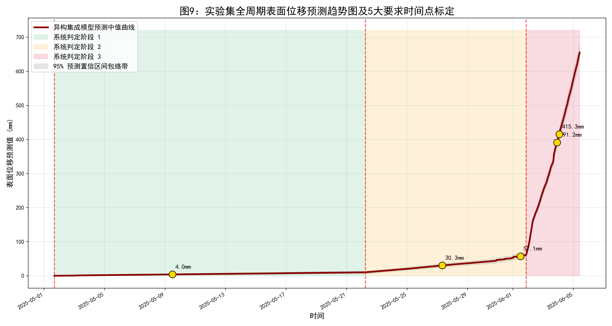 | 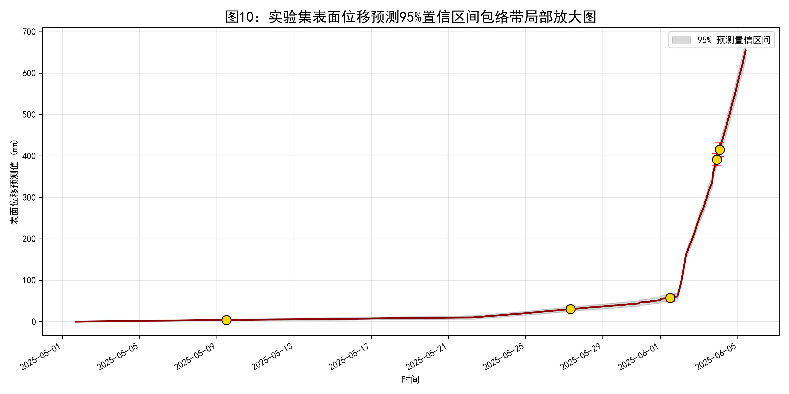 |

## 运行方式

```bash
pip install pandas numpy scikit-learn matplotlib seaborn scipy xgboost
cd q4_staged_prediction
python main.py
```

程序自动完成：Excel 读取 → 特征工程 → EDA → K-Means 阶段划分 → 集成模型训练 → 实验集预测校准 → 18 张图表生成。运行时间约 2-3 分钟。
