# 问题 5：特征组合寻优与四级预警机制

## 问题定义

1. **问题 5.1**: 从 6 个变量中选出最优 5 变量组合构建位移预测模型
2. **问题 5.2**: 基于位移速度分阶段分析，建立四级滑坡预警机制

## 完整代码管线 (`main.py`)

### 数据预处理模块

```python
def load_and_preprocess_data(file_path):
    # 加载 6 维时序数据 → 异常值剔除 → Savitzky-Golay 平滑
    # 变量: 降雨量, 孔压, 微震事件, 爆破烈度, 爆破距离, 单段药量

    # Savitzky-Golay: window_length=21, polyorder=2
    df['位移_SG'] = savgol_filter(df['表面位移'], 21, 2)
```

### 问题 5.1: 穷举搜索 + LSTM-Attention

```python
# 方法1: 组合穷举 C(6,5) = 6 种
ALL_FEATURES = ['降雨量', '孔压', '微震事件', '爆破烈度', '爆破距离', '单段药量']

for drop_col in ALL_FEATURES:
    selected = [f for f in ALL_FEATURES if f != drop_col]

    # 5折交叉验证
    rf = RandomForestRegressor(n_estimators=200, max_depth=10)
    gb = GradientBoostingRegressor(n_estimators=200, max_depth=5)

    tscv = TimeSeriesSplit(n_splits=5)
    for train_idx, test_idx in tscv.split(X):
        rf.fit(X[train_idx], y[train_idx])
        gb.fit(X[train_idx], y[train_idx])
        # 记录 RMSE, R²

    results[drop_col] = {'rf_rmse': ..., 'gb_rmse': ..., 'rf_r2': ..., 'gb_r2': ...}

# 方法2: LSTM-Attention 特征权重学习
class AttentionNet(nn.Module):
    def __init__(self, input_dim=6, hidden_dim=128, num_heads=4):
        self.lstm = nn.LSTM(input_dim, hidden_dim, batch_first=True)
        self.attention = nn.MultiheadAttention(hidden_dim, num_heads)
        self.fc = nn.Linear(hidden_dim, 1)

    def forward(self, x):
        out, _ = self.lstm(x)          # (B, T, H)
        out, weights = self.attention(out, out, out)  # self-attention
        # weights 即为特征重要性
        return self.fc(out[:, -1, :]), weights

# 互信息验证
mi_scores = mutual_info_regression(X, y)
# 结合 Attention 权重 + MI 分数 → 综合排序
```

### 问题 5.2: 四级预警机制

```python
# 速度-加速度双参数判据
velocity = savgol_filter(gradient(displacement), 21, 2)
acceleration = gradient(velocity)

# 四级递进式预警
def classify_warning(v, a):
    if v < v_threshold_1 and abs(a) < a_threshold:
        return 0  # "安全"
    elif v_threshold_1 < v < v_threshold_2:
        return 1  # "注意"
    elif v_threshold_2 < v < v_threshold_3 and a > 0:
        return 2  # "警戒"
    elif v > v_threshold_3 and a > 0:
        return 3  # "危险"
```

## 输出图表（16 张）

### 数据概览

| 预处理对比 | 降雨量时序 | 爆破事件分布 |
|:---:|:---:|:---:|
| 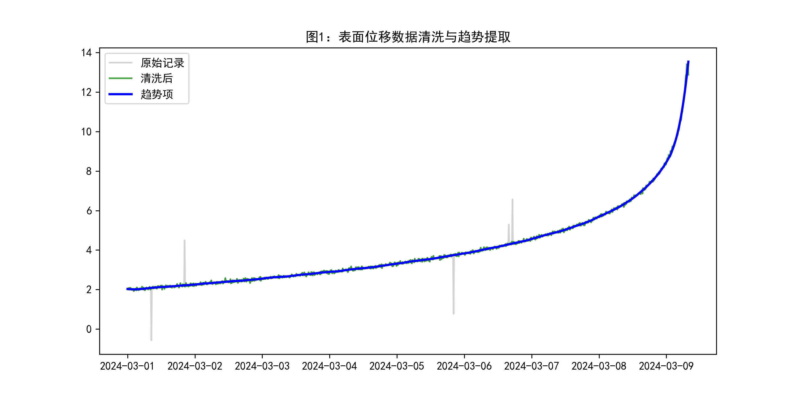 | 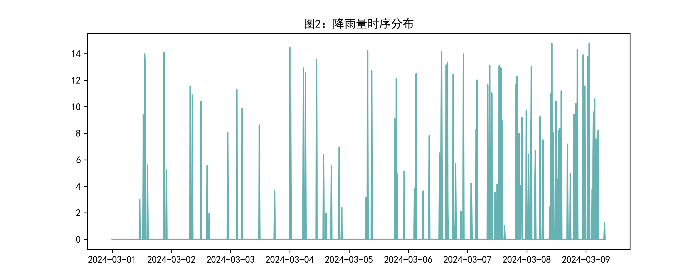 | 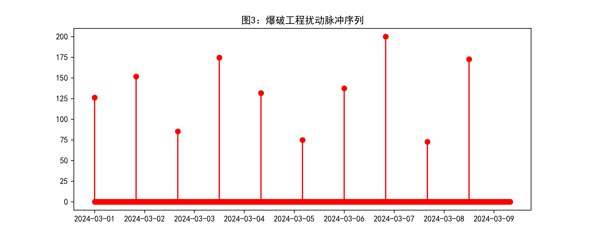 |

### 相关性分析

| 相关热力图 | 孔压时序 |
|:---:|:---:|
| 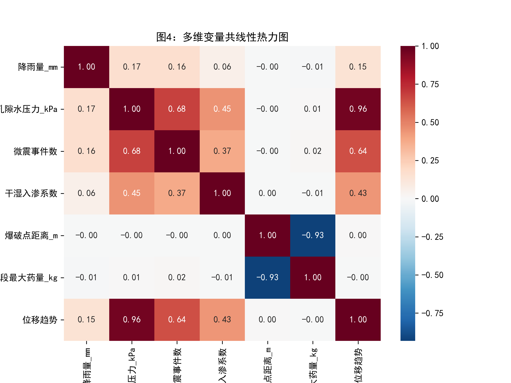 | 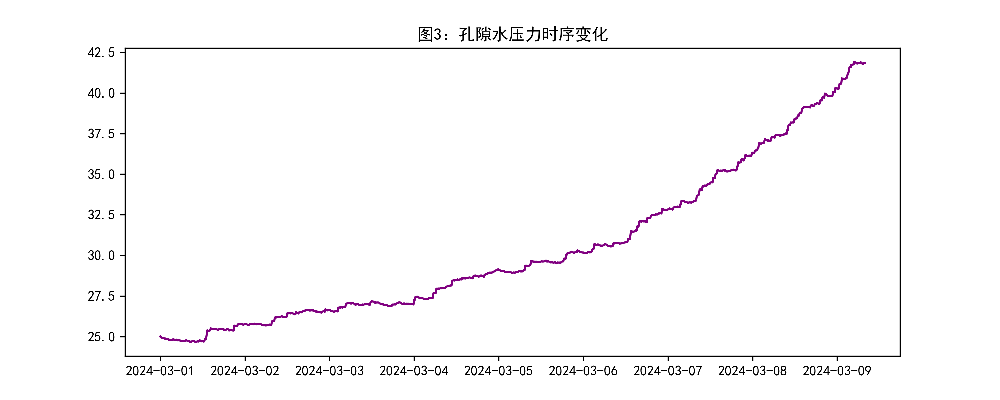 |

### 特征寻优结果

| 6 组合 RMSE 对比 | 互信息排序 |
|:---:|:---:|
| 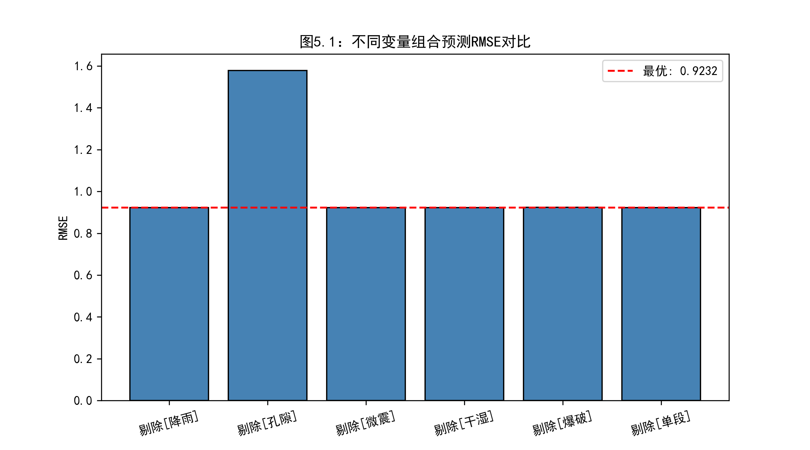 | 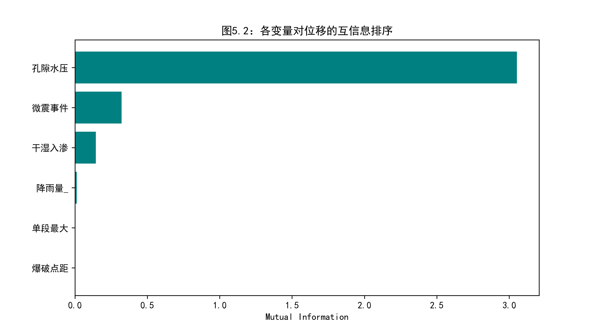 |

### LSTM-Attention 训练

| 损失曲线 | 拟合效果 |
|:---:|:---:|
| 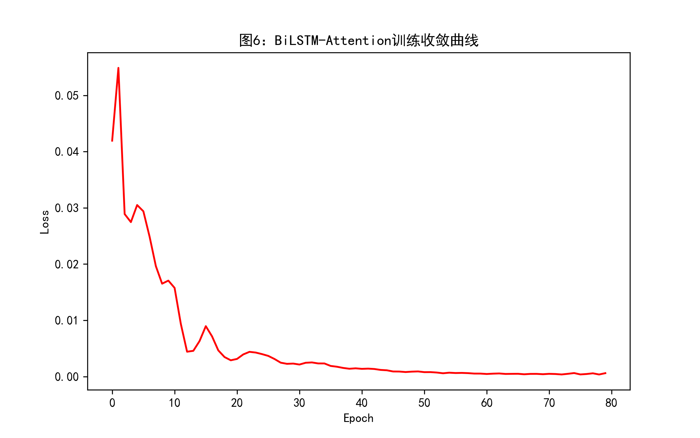 | 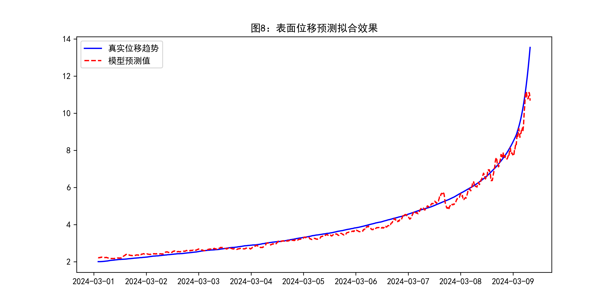 |

### 残差分析

| 残差分布 | 误差时序 | TTF 预警曲线 |
|:---:|:---:|:---:|
| 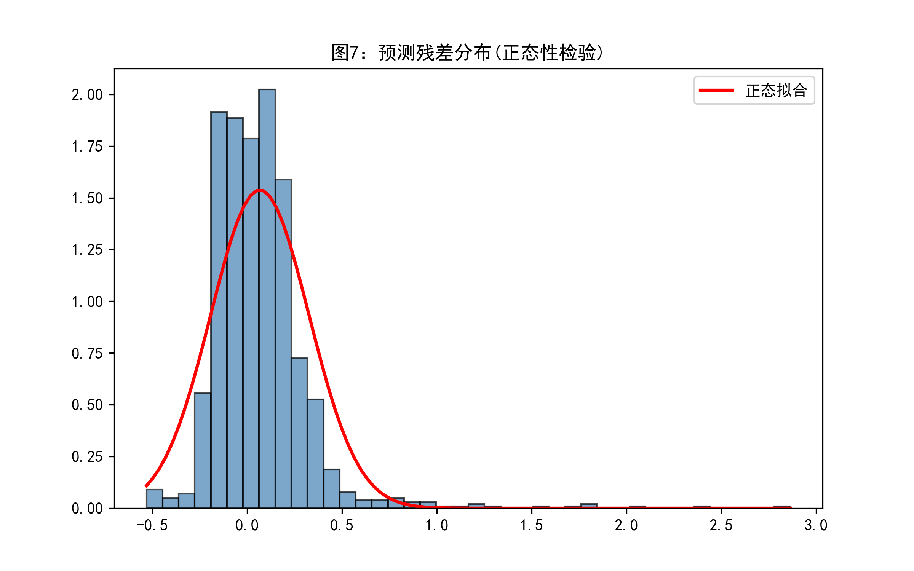 | 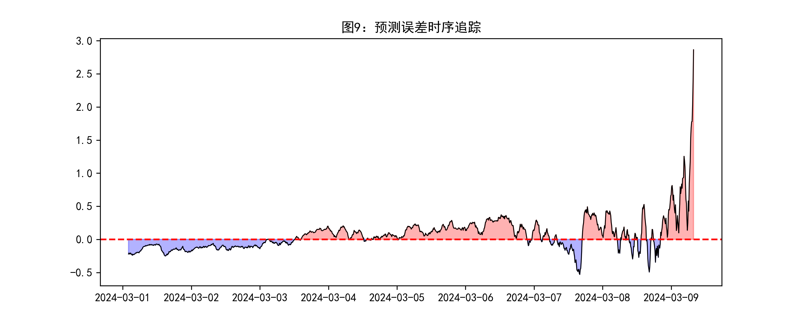 | 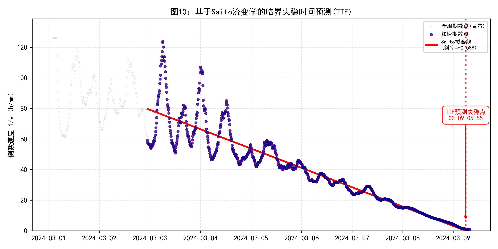 |

### 预警系统

| 四级预警阶梯 | 阶段分割 | 预警饼图 |
|:---:|:---:|:---:|
| 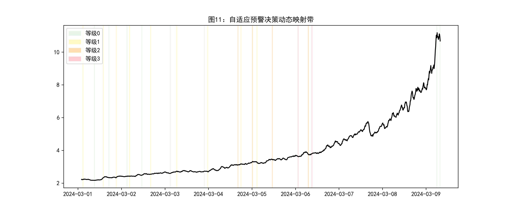 | 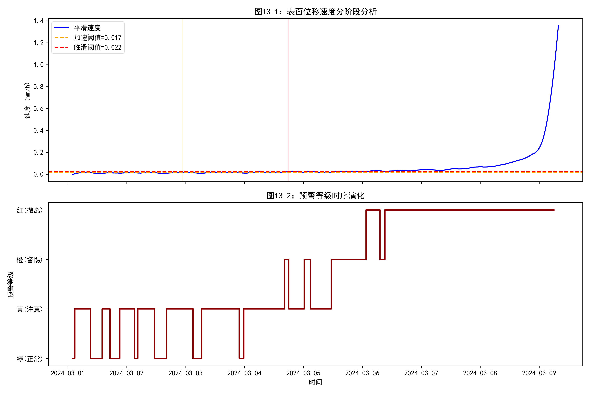 | 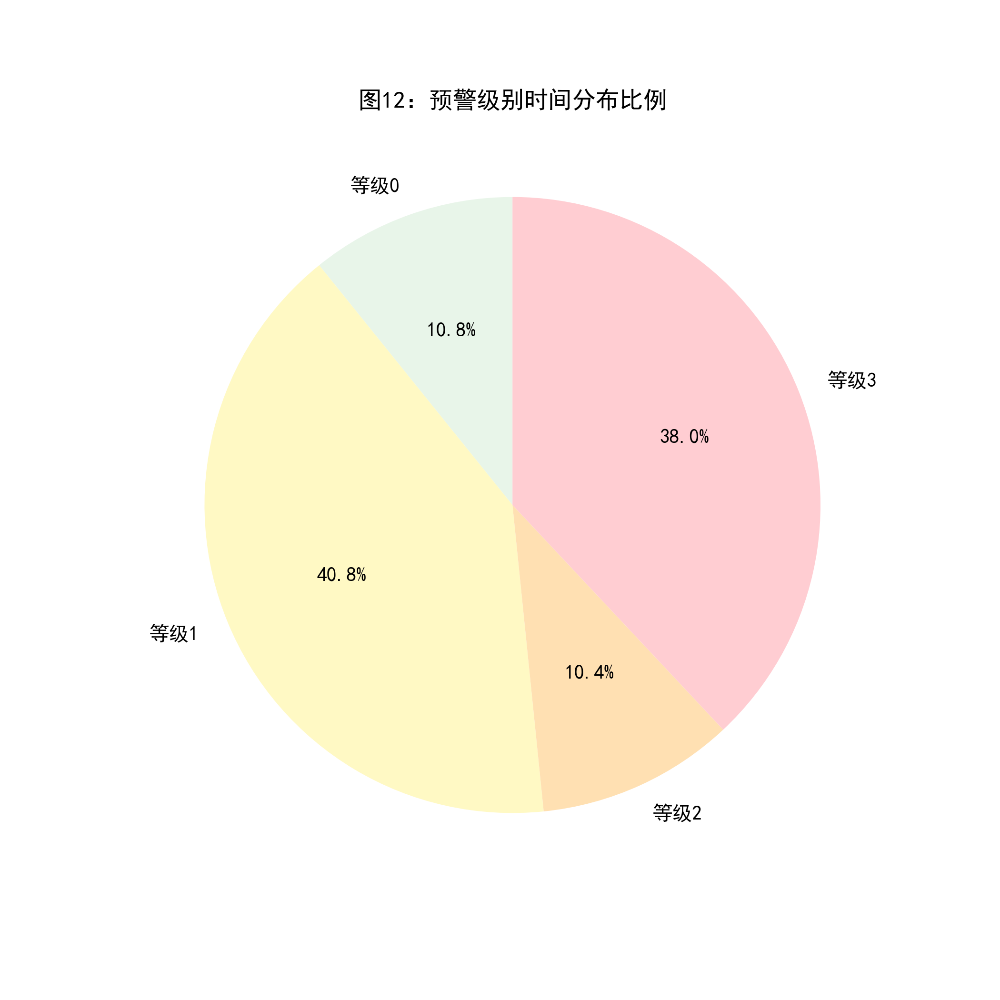 |

## 运行方式

```bash
pip install torch numpy pandas scikit-learn matplotlib seaborn scipy
cd q5_feature_warning
python main.py
```

程序自动完成：数据加载 → 6 组合穷举搜索 → 交叉验证评估 → LSTM-Attention 训练 → 四级预警阈值计算 → 16 张图表生成。
